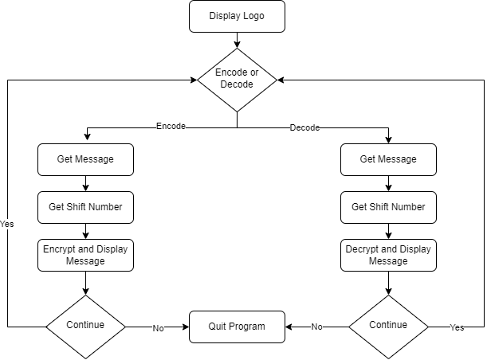

# Caesar Cipher

Caesar cipher is an encryption technique invented by Gaius Julius Caesar. It involves replacing each letter in a text with another letter positioned a fixed number of places up or down the alphabet.

Below is an example with a right shift of one position:

|          |  |  |  |  |  |  |  |  |  |  |  |  |  |  |  |  |  |  |  |  |  |  |  |  |  |
|:---------|:-|:-|:-|:-|:-|:-|:-|:-|:-|:-|:-|:-|:-|:-|:-|:-|:-|:-|:-|:-|:-|:-|:-|:-|:-|
|**Text**  |A |B |C |D |E |F |G |H |I |J |K |L |M |N |O |P |Q |R |S |T |U |W |X |Y |Z |
|**Cipher**|B |C |D |E |F |G |H |I |J |K |L |M |N |O |P |Q |R |S |T |U |W |X |Y |Z |A |

If we wish to encrypt *'hello world!'* using the mentioned cipher, the result is *'ifmmp xpsme!'*. 

# Instructions 

1. Choose either "encode" for encrypting or "decode" for decrypting.
2. Specify the shift number for encryption or decryption.
3. The program will automatically encrypt when you choose "encode" and decrypt when you choose "decode."
4. The result, either the encoded or decoded message, will be displayed.
5. Choose to continue with another operation or quit the program as needed.

# Flowchart 

The flowchart of the "Caesar Cipher" is as follows: 

# References

- [Gaius Julius Caesar - Wikipedia](https://simple.wikipedia.org/wiki/Julius_Caesar#)
- [Caesar Cipher - Wikipedia](https://en.wikipedia.org/wiki/Caesar_cipher)
- [Caesar Cipher - Khan Academy](https://www.khanacademy.org/computing/computer-science/cryptography/crypt/v/caesar-cipher#) 

[Back to Beginners Projects](https://github.com/ErkanHatipoglu/100-days-of-code/beginner_projects)

[Back to main page](https://github.com/ErkanHatipoglu/100-days-of-code)