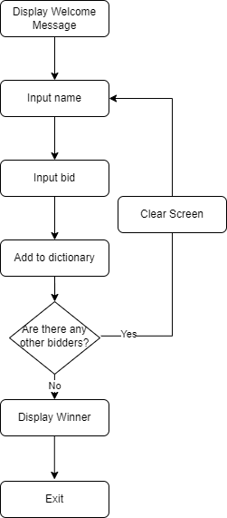

# Secret Auction

A secret auction (blind auction) is where bidders submit bids secretly so that no one in the auction knows the other's offer. At the end of the secret auction, the highest bidder wins.

In this project, we intend to write a program we can use to organize a blind auction. We will gather name and bid amount information from all the bidders, store this information in a dictionary, and display the winner at the end of the auction. 

Since this is a secret auction, bidders should not see other's offers. So, after each user makes their offer, the program should clear the screen.

An indefinite number of people can join a blind auction. After a user makes his / her offer, the program will ask if there is another bidder. If 'yes' is selected, the program will delete the screen and ask for another bidder. If 'no' is selected, the auction will end, and the program will display the winner.

# Instructions 

1. Enter the name of the first bidder.
2. Enter the bid amount of the first bidder.
3. The program will add the bidder's name and bid amount to the auction dictionary.
4. If there are more bidders, input "yes" to repeat steps 1-3 (the program will automatically clear the screen); otherwise, input "no" to continue.
5. The program will determine the highest bid amount in the auction dictionary and announce the winner.
6. Quit the program when done.  

# Flowchart 

The flowchart of the "Secret Auction" is as follows: 

# References

- [First-price sealed-bid auction - Wikipedia](https://en.wikipedia.org/wiki/First-price_sealed-bid_auction) 

[<< Back to Beginners Projects](https://github.com/ErkanHatipoglu/100-days-of-code/tree/main/beginner_projects) | [Back to Main Page >>](https://github.com/ErkanHatipoglu/100-days-of-code)