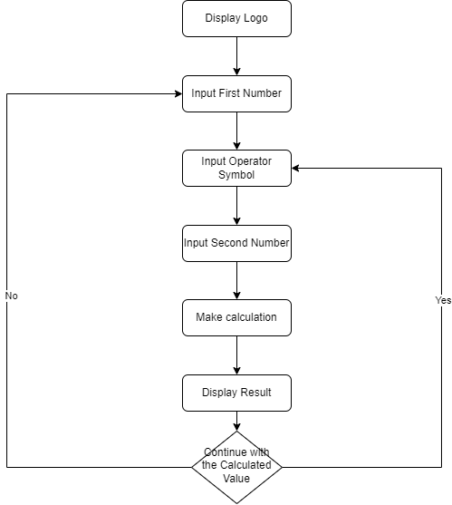

# Calculator App

Welcome to the Simple Calculator program! This tool allows you to perform basic calculations with ease.

# Instructions 

1. Enter the first number.
2. Input the operator symbol (+, -, *, /).
3. Enter the second number.
4. The program will perform the calculation and display the result.
5. Choose 'yes' to continue using the calculated value, or 'no' to start a new calculation from the beginning.

# Flowchart 

The flowchart of the "Calculator App" is as follows: 

# References

[Dictionaries - Python documentation](https://docs.python.org/3/tutorial/datastructures.html#dictionaries)

[Back to main page](https://github.com/ErkanHatipoglu/100-days-of-code)