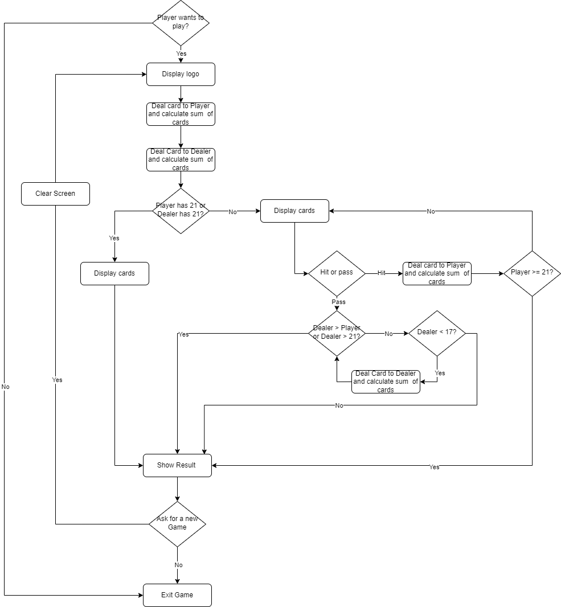

# Blackjack Game

## Overview
This is a simple implementation of the Blackjack game in Python. The game allows users to play against a computer dealer, following standard Blackjack rules. It provides a text-based interface and offers an interactive experience for users to make decisions during the game.

## Instructions
- Run the Python script to initiate the Blackjack game.
- Follow the on-screen prompts to make decisions such as getting another card or passing.
- The game will display the player's and dealer's cards along with the current score.
- The goal is to have a hand value as close to 21 as possible without exceeding it.
- The game will determine the winner based on the final scores.

## Flowchart
The flowchart of the "Blackjack Game" is as follows: 

## References
- [Blackjack - Wikipedia](https://en.wikipedia.org/wiki/Blackjack)
- [OpenAI GPT](https://www.openai.com/)

Feel free to explore, modify, and enjoy the game!

[Back to main page](https://github.com/ErkanHatipoglu/100-days-of-code)