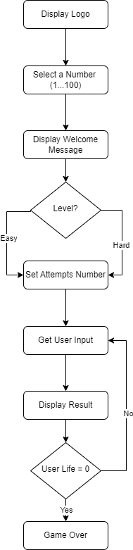

# Number Guessing Game

## Overview
This repository contains Python code for a simple "Number Guessing Game." The game prompts users to guess a randomly generated number within a specified range. Users can choose between easy and hard difficulty levels, each with a different number of attempts.

## Instructions
1. Run the Python script number_guessing_game.py.
2. Follow the on-screen instructions to select the difficulty level (easy or hard).
3. Input your guesses when prompted.
4. The game will provide feedback on each guess, indicating if it's too high, too low, or correct.
5. Continue guessing until you correctly identify the number or run out of attempts.

## Flowchart
The flowchart of the "Number Guessing Game" is as follows: 

## References
- [Guessing Games - Wikipedia](https://en.wikipedia.org/wiki/Guessing#Games)
- [A Guessing Game - Khan Academy](https://www.khanacademy.org/computing/computer-science/algorithms/intro-to-algorithms/a/a-guessing-game)
- [OpenAI GPT](https://www.openai.com/)

[Back to main page](https://github.com/ErkanHatipoglu/100-days-of-code)