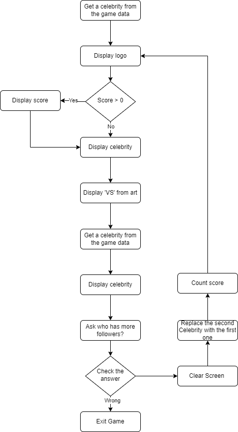

# Higher Lower Game

## Overview
The Higher Lower Game is a fun and engaging Python project where players guess which celebrity has more followers on Instagram. Based on simple yet addictive gameplay, it challenges players' knowledge of popular culture. This game is developed as part of my journey in learning Python and exploring its capabilities in creating interactive applications.

## Instructions
1. Run the game using the command: python high_low.py.
2. The game will display two celebrities. Guess which one has more Instagram followers by typing 'A' or 'B'.
3. The game continues as long as your guesses are correct. It ends when a wrong guess is made.
4. Your score is the number of consecutive correct guesses.

## Flowchart
The flowchart of the "Higher Lower Game" is as follows: 

## References
- [Try Online](https://www.higherlowergame.com/)
- [OpenAI GPT](https://www.openai.com/)

[Back to main page](https://github.com/ErkanHatipoglu/100-days-of-code)