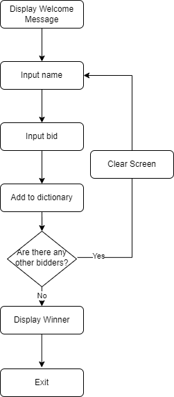

# Secret Auction
A secret auction (blind auction) is where bidders submit bids secretly so that no one in the auction knows the other's offer. At the end of the secret auction, the highest bidder wins.

# Flowchart 
The flowchart of the "Secret Auction" is as follows: 

# Instructions 

# References
- [First-price sealed-bid auction - Wikipedia](https://en.wikipedia.org/wiki/First-price_sealed-bid_auction) 