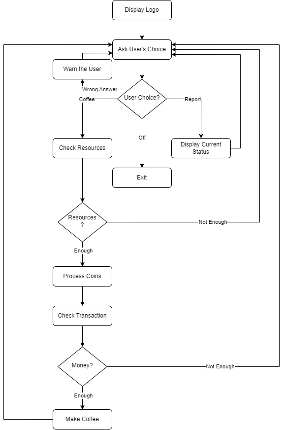

# Coffee Machine

## Overview
The Coffee Machine project is a Python-based simulation that mimics the operation of a real coffee machine. It offers an interactive experience where users can select a beverage from a menu that includes espresso, latte, and cappuccino, each with unique ingredients and costs. The program allows users to turn off the machine, get a report on the current status of resources like water, milk, and coffee, and handles monetary transactions including coin processing and change calculations.

## Instructions
1. Run the script to start the coffee machine program.
2. Choose a beverage from the displayed menu.
3. If necessary, insert coins as prompted.
4. The machine will check if enough resources are available and if sufficient money has been inserted.
5. If both checks pass, the beverage will be prepared and served.
6. The program offers the option to turn off the machine or get a report on the machine's resources at any time.

## Flowchart
The flowchart of the "Coffee Machine" is as follows: 

## References
- [OpenAI GPT](https://www.openai.com/)

[<< Back to Intermediate Projects](https://github.com/ErkanHatipoglu/100-days-of-code/tree/main/intermediate_projects) | [Back to Main Page >>](https://github.com/ErkanHatipoglu/100-days-of-code)